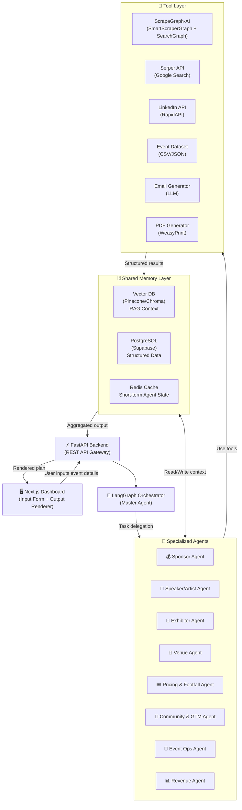
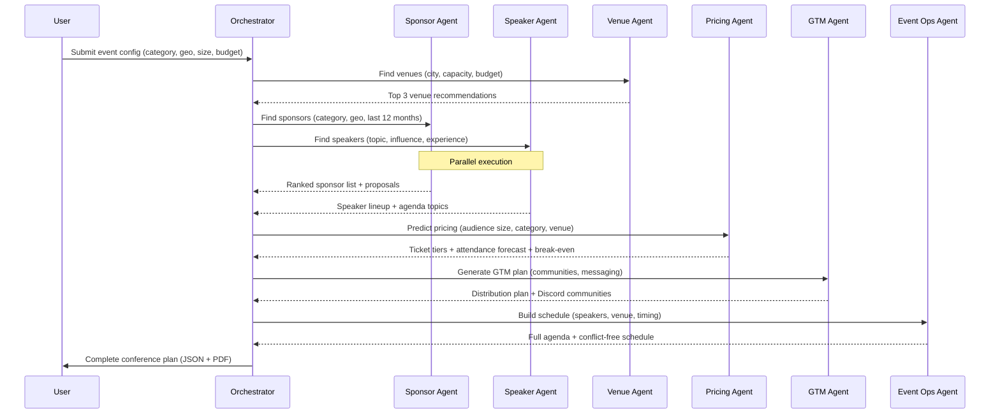

# AI-Powered Multi-Agent Conference Organizer
### Pinch × IIT Roorkee — General Championship 2026

> **Team**: 5 members | **Timeline**: 7 days | **Domain**: Conferences (extendable to Music Festivals & Sporting Events)

---

## Getting Started

### 1. Clone the repo
```bash
git clone https://github.com/DarshanCode2005/ConfMind.git
cd ConfMind
```

### 2. Set up Python environment
```bash
# Create a virtual environment
python3 -m venv venv

# Activate it
source venv/bin/activate        # Linux / macOS
# venv\Scripts\activate         # Windows

# Install dev tools (Ruff linter + Pyright type checker)
pip install -r requirements-dev.txt
```

### 3. Set up Node / commit tooling
```bash
# Install Commitizen + Husky + Commitlint
npm install

# Fix hook permissions (run once after cloning)
chmod +x .husky/pre-commit
```

> [!IMPORTANT]
> **Steps 2 and 3 are mandatory for all team members.** Without them, the pre-commit linting hook won't run and commit messages won't be validated.

### 4. Making commits
Use the interactive prompt to ensure correct commit format:
```bash
npm run commit
# OR manually:
git commit -m "feat(scope): describe WHY, not just what"
```

**Valid types**: `feat` · `fix` · `docs` · `style` · `refactor` · `test` · `chore`

### 5. Manual lint / type-check commands
```bash
npm run lint:py        # Ruff: check for issues
npm run format:py      # Ruff: auto-format all Python files
npm run typecheck:py   # Pyright: static type analysis
```

---

## Table of Contents
1. [Project Overview](#project-overview)
2. [Tech Stack](#tech-stack)
3. [System Architecture](#system-architecture)
4. [Agent Specifications](#agent-specifications)
5. [Data Layer](#data-layer)
6. [Team Work Division](#team-work-division)
7. [7-Day Timeline](#7-day-timeline)
8. [Repository Structure](#repository-structure)
9. [Evaluation Alignment](#evaluation-alignment)

---

## 1. Project Overview

**ConfMind** — An end-to-end AI-powered conference orchestration platform where 8 specialized agents collaborate to plan a full conference/event from scratch.

### Input
- Event category (AI, Web3, ClimateTech, etc.)
- Geography (Europe, India, USA, Singapore)
- Target audience size & budget range
- Event dates

### Output
- Sponsor shortlist + customized proposals
- Speaker lineup + agenda
- Exhibitor clusters
- Venue recommendations
- Ticket pricing tiers + attendance forecast
- Community GTM distribution plan
- Full schedule with conflict detection
- Revenue projection & break-even analysis

### Differentiators
- Domain-agnostic agent architecture (Conferences + Music Festivals + Sporting Events)
- Agents share memory via vector DB (RAG)
- Autonomous outreach draft generation (email/LinkedIn)
- What-if simulation dashboard
- Multi-agent collaboration visualization

---

## 2. Tech Stack

| Layer | Technology | Purpose |
|---|---|---|
| **Frontend** | Next.js 14 + Tailwind CSS + shadcn/ui | Dashboard UI |
| **Backend / API** | FastAPI (Python) | REST API, agent orchestration |
| **Agent Framework** | LangChain + LangGraph | Agent definitions, tool use, graph execution |
| **LLM** | OpenAI GPT-4o / Gemini 1.5 Pro | Agent reasoning |
| **Vector DB** | Pinecone / ChromaDB | RAG memory for agents |
| **Relational DB** | PostgreSQL (Supabase) | Structured event/sponsor/speaker data |
| **Scraping** | **ScrapeGraph-AI** (SmartScraperGraph + SearchGraph) | LLM-powered structured extraction, no brittle selectors |
| **Data Pipeline** | Python + Pandas | ETL, cleaning, normalization |
| **Auth** | Supabase Auth | User management |
| **Deployment** | Vercel (Frontend) + Railway/Render (Backend) | Hosted prototype |
| **Visualization** | D3.js / Recharts | Simulation dashboard, agent graph |
| **Documents** | Jinja2 + WeasyPrint | PDF proposal generation |

---

## 3. System Architecture



### Agent Communication Flow


---

## 4. Agent Specifications

### Agent 1 — Sponsor Agent
- **Tools**: ScrapeGraph-AI `SearchGraph` (search + scrape sponsors), Event dataset (CSV), LLM
- **Inputs**: category, geography, event_size
- **Logic**:
  1. `SearchGraph("AI conference sponsors Europe 2025")` → scrapes + extracts sponsors from top results automatically
  2. Returns structured JSON `{name, website, industry}` — no selector maintenance
  3. Score each sponsor: `industry_relevance (0-10) + geo_match (0-5) + historical_freq (0-5)`
  4. LLM generates a personalized sponsorship proposal (PDF via Jinja2)
- **Output**: `{ sponsors: [{name, relevance_score, tier, proposal_pdf_url}] }`

### Agent 2 — Speaker/Artist Agent
- **Tools**: ScrapeGraph-AI `SearchGraph`, LinkedIn RapidAPI, Event dataset
- **Inputs**: topic, event_type, region
- **Logic**:
  1. `SearchGraph("AI conference speakers India 2025")` → extracts names, bios, talks automatically
  2. Enrich with LinkedIn data (followers, recent posts, publications)
  3. Score: `topic_relevance + influence_score + speaking_experience`
  4. Map speakers to agenda topics (LLM)
- **Output**: `{ speakers: [{name, linkedin, score, suggested_topic}], agenda: [...] }`

### Agent 3 — Exhibitor Agent
- **Tools**: ScrapeGraph-AI `SearchGraph`, Event dataset, LLM clustering
- **Logic**:
  1. `SearchGraph("exhibitors at [category] conference 2025")` → structured exhibitor list
  2. LLM clusters by: startup/enterprise/tools/individual
  3. Ranks by relevance to event theme
- **Output**: `{ exhibitors: [{name, cluster, relevance}] }`

### Agent 4 — Venue Agent
- **Tools**: ScrapeGraph-AI `SmartScraperGraph` on Eventlocations.com + Cvent, LLM
- **Logic**:
  1. `SmartScraperGraph(url="eventlocations.com/...", prompt="Extract venue name, capacity, price, past events")` → clean JSON
  2. Scrape pricing, capacity, past event usage from event sites
  3. Score: `capacity_fit + budget_fit + past_event_prestige`
- **Output**: `{ venues: [{name, city, capacity, price_range, past_events, score}] }`

### Agent 5 — Pricing & Footfall Agent
- **Tools**: Historical event dataset, Scikit-learn (regression model), LLM
- **Logic**:
  1. Load historical data: event_type → past_price → past_attendance
  2. Train/use regression model: `predict_attendance(event_type, price, city, size)`
  3. Generate 3 pricing tiers: Early Bird, General, VIP
  4. Calculate conversion rate per tier
- **Output**: `{ tiers: [{name, price, est_sales, revenue}], total_est_revenue, break_even_price }`

### Agent 6 — Community & GTM Agent
- **Tools**: Discord API, Serper, LLM
- **Logic**:
  1. Search topic-relevant Discord servers
  2. Categorize communities by niche
  3. LLM generates platform-specific GTM messages
  4. Output prioritized distribution plan
- **Output**: `{ communities: [{platform, name, size, niche}], gtm_messages: {...}, distribution_plan: [...] }`

### Agent 7 — Event Ops Agent (HIGHLY RECOMMENDED)
- **Tools**: LLM, Calendar conflict checker
- **Logic**:
  1. Takes speaker list + agenda topics + venue rooms
  2. Assigns time slots (greedy scheduling)
  3. Detects conflicts (same speaker, same time)
  4. Outputs final schedule
- **Output**: `{ schedule: [{time, room, speaker, topic}], conflicts: [...] }`

### Agent 8 — Revenue Agent (Optional/Bonus)
- **Tools**: Outputs from Agents 5 + 1 + 3
- **Logic**:
  1. Combine ticket revenue + sponsorship value + exhibitor fees
  2. Model what-if scenarios
- **Output**: `{ total_revenue, cost_estimate, profit, break_even_analysis, simulation_chart_data }`

---

## 5. Data Layer

### Mandatory Dataset (CSV + JSON)

Collect 100–200 events from 2025–2026 across categories and geographies.

**Schema**:
```
event_name, date, city, country, category, theme, sponsors[], speakers[],
exhibitors[], ticket_price_early, ticket_price_general, ticket_price_vip,
estimated_attendance, venue_name, venue_capacity, source_url
```

**Sources**:
| Source | Method (ScrapeGraph-AI) |
|---|---|
| Eventbrite | `SmartScraperGraph` → prompt: "Extract event name, sponsors, speakers, ticket price, attendance" |
| Luma | `SmartScraperGraph` → same prompt |
| Sessionize | `SmartScraperGraph` → extract speaker names, topics, bios |
| Cvent.com | `SmartScraperGraph` → venue + event data |
| Eventlocations.com | `SmartScraperGraph` → venue capacity, pricing |
| Google Search | `SearchGraph` → discover sponsor/speaker pages automatically |
| Manual curation | LinkedIn (for enrichment only) |

**Normalization**:
- Dates → ISO 8601
- Country/City → standardized names
- Ticket prices → USD equivalent
- Sponsors/Speakers → deduplicated by name+org

---

## 6. Team Work Division

> Roles: **P1** = You (Lead Dev) | **P2** = Backend/Agents | **P3** = Data Engineer | **P4** = Frontend | **P5** = Product Owner (PM + Docs + Presentation)

---

### 👤 P1 — You (Lead / Orchestration + Agent Framework)
**Owns**: LangGraph orchestrator, agent-to-agent context sharing, vector DB setup, system integration

**Deliverables**:
- LangGraph orchestration graph (`orchestrator.py`)
- Agent base class + tool registration pattern
- Pinecone/ChromaDB setup + RAG embedding pipeline
- FastAPI routes: `/api/run-plan`, `/api/agent-status`, `/api/output`
- Redis for short-term agent state
- Integration glue for all 8 agents
- Final system demo + Github management

**Skills needed**: Python, LangChain/LangGraph, FastAPI, vector DBs

---

### 👤 P2 — Backend Developer (Agents: Sponsor + Speaker + Exhibitor + Revenue)
**Owns**: Agents 1, 2, 3, 8 — discovery and recommendation logic

**Deliverables**:
- `sponsor_agent.py` — Serper search + scoring + proposal PDF generation
- `speaker_agent.py` — LinkedIn enrichment + agenda topic mapping
- `exhibitor_agent.py` — clustering + ranking
- `revenue_agent.py` — revenue projection + break-even analysis
- Jinja2 templates for sponsorship proposal PDFs
- Relevance scoring functions (rule-based + LLM hybrid)

**Skills needed**: Python, LangChain, Serper API, PDF generation

---

### 👤 P3 — Data Engineer (Data Pipeline + Venue + Pricing Agents)
**Owns**: Event dataset creation, scraping pipelines, Agents 4 + 5

**Deliverables**:
- Playwright scrapers for Eventbrite, Luma, Cvent, Eventlocations
- Pandas ETL pipeline → normalized CSV + JSON dataset (100–200 events)
- `venue_agent.py` — scraping + scoring
- `pricing_agent.py` — regression model + ticket tier simulation
- Dataset documentation (sources, methods, schema)
- PostgreSQL schema + Supabase setup

**Skills needed**: Python, Playwright, Pandas, Scikit-learn, SQL

---

### 👤 P4 — Frontend Developer (Dashboard UI)
**Owns**: Next.js frontend — input form, output rendering, visualization

**Deliverables**:
- Input wizard: event category, geography, size, budget, dates
- Output dashboard:
  - Sponsor cards with proposal download
  - Speaker grid with LinkedIn badges
  - Venue comparison table
  - Ticket tier pricing cards + attendance chart (Recharts)
  - Community GTM plan view
  - Schedule timeline (Event Ops output)
  - Revenue simulation "What-If" panel
- Agent collaboration graph (D3.js or React Flow)
- PDF export button
- Responsive, dark-mode UI (shadcn/ui + Tailwind)

**Skills needed**: Next.js, TypeScript, Recharts/D3, Tailwind CSS

---

### 👤 P5 — Product Owner (PM + Community + GTM Agent + Docs)
**Owns**: Project management, Agent 6 (Community GTM), engineering document, presentation

**Deliverables**:
- `community_gtm_agent.py` — Discord search + LLM messaging
- `event_ops_agent.py` — schedule builder + conflict detection (Agent 7)
- Engineering documentation report
- Product requirements document (PRD)
- Demo video script + recording coordination
- Final presentation deck (Canva/Figma)
- GitHub README
- Discord server outreach research (manual curation)

**Skills needed**: Python basics, LangChain, writing, presentation

---

### 📊 Responsibility Matrix

| Deliverable | P1 | P2 | P3 | P4 | P5 |
|---|:---:|:---:|:---:|:---:|:---:|
| LangGraph Orchestrator | ✅ | | | | |
| FastAPI Backend | ✅ | | | | |
| Vector DB / RAG | ✅ | | | | |
| Sponsor Agent | | ✅ | | | |
| Speaker Agent | | ✅ | | | |
| Exhibitor Agent | | ✅ | | | |
| Revenue Agent | | ✅ | | | |
| Event Dataset (CSV/JSON) | | | ✅ | | |
| Scraping Pipelines | | | ✅ | | |
| Venue Agent | | | ✅ | | |
| Pricing Agent | | | ✅ | | |
| PostgreSQL / Supabase | | | ✅ | | |
| Next.js Dashboard | | | | ✅ | |
| Visualization / Charts | | | | ✅ | |
| Community GTM Agent | | | | | ✅ |
| Event Ops Agent | | | | | ✅ |
| Engineering Doc | | | | | ✅ |
| Presentation Deck | | | | | ✅ |
| Demo Video | ✅ | | | | ✅ |
| GitHub Management | ✅ | | | | |

---

## 7. 7-Day Timeline

### Day 1 (Mon) — Setup + Architecture Alignment
| Person | Task |
|---|---|
| **P1** | Setup GitHub repo, project structure, FastAPI skeleton, LangGraph skeleton |
| **P2** | Setup Serper API keys, test sponsor search queries, design agent base class |
| **P3** | Setup ScrapeGraph-AI, write `SmartScraperGraph` prompts for Eventbrite + Luma |
| **P4** | Setup Next.js app, design system (Tailwind + shadcn), build input wizard form |
| **P5** | Write PRD, define event schema, research Discord communities manually |

**End of Day 1**: Repo live, API keys secured, scraper running, UI form working

---

### Day 2 (Tue) — Core Agents + Data
| Person | Task |
|---|---|
| **P1** | Implement LangGraph graph, agent communication, Pinecone/Chroma setup |
| **P2** | Build `sponsor_agent.py` (search + scoring), start `speaker_agent.py` |
| **P3** | Run ScrapeGraph-AI on Eventbrite, Luma, Cvent → extract 50+ events, begin CSV cleaning |
| **P4** | Build output dashboard shell (cards, tables, layout placeholders) |
| **P5** | Build `community_gtm_agent.py` (Discord search + LLM message generation) |

---

### Day 3 (Wed) — Agents Complete
| Person | Task |
|---|---|
| **P1** | Connect agents to orchestrator, test end-to-end flow for 1 event |
| **P2** | Complete `speaker_agent.py`, `exhibitor_agent.py`, test outputs |
| **P3** | Complete dataset (100+ events), normalize, write `venue_agent.py` |
| **P4** | Wire API responses to UI, implement sponsor cards + speaker grid |
| **P5** | Build `event_ops_agent.py` (schedule builder + conflict detection) |

---

### Day 4 (Thu) — Integration + Pricing
| Person | Task |
|---|---|
| **P1** | RAG pipeline: embed dataset into vector DB, test retrieval |
| **P2** | Build `revenue_agent.py`, integrate with pricing output |
| **P3** | Build `pricing_agent.py` (regression model + tier simulation) |
| **P4** | Implement ticket pricing cards, attendance charts (Recharts) |
| **P5** | Draft engineering document, start writing README |

---

### Day 5 (Fri) — Polish + Bonus Features
| Person | Task |
|---|---|
| **P1** | What-if simulation endpoint, outreach draft generation (email/LinkedIn) |
| **P2** | PDF sponsorship proposal generation (Jinja2 + WeasyPrint) |
| **P3** | PostgreSQL schema + Supabase seeding with dataset |
| **P4** | Agent collaboration graph (React Flow / D3), What-If panel, PDF export |
| **P5** | Engineering doc draft complete, start presentation deck |

---

### Day 6 (Sat) — Testing + Deployment
| Person | Task |
|---|---|
| **P1** | Deploy FastAPI to Railway/Render, end-to-end system test |
| **P2** | Test all 4 agents on 3 event scenarios, fix edge cases |
| **P3** | Deploy Supabase, verify dataset CSV/JSON downloadable |
| **P4** | Deploy Next.js to Vercel, cross-browser testing, mobile responsive |
| **P5** | Complete presentation, plan demo video flow |

---

### Day 7 (Sun) — Demo + Submission
| Person | Task |
|---|---|
| **P1** | Record demo video (technical walkthrough), final GitHub cleanup |
| **P2** | Write code comments + API docs, submit agent notes |
| **P3** | Finalize dataset documentation (sources + extraction methods) |
| **P4** | Final UI polish, screenshot all outputs for presentation |
| **P5** | Record demo video narration, submit all deliverables |

**Submission**: GitHub repo + hosted URL + demo video + engineering doc + dataset CSV/JSON

---

## 8. Repository Structure

```
confmind/
├── README.md
├── package.json                  # Root dev tools (Commitizen, Husky)
├── implementation_plan.md
├── engineering_doc.md
├── dataset/
│   ├── events_2025_2026.csv
│   ├── events_2025_2026.json
│   └── dataset_documentation.md
├── backend/
│   ├── main.py                   # FastAPI entry point
│   ├── orchestrator.py           # LangGraph master agent
│   ├── agents/
│   │   ├── base_agent.py         # Agent base class
│   │   ├── sponsor_agent.py
│   │   ├── speaker_agent.py
│   │   ├── exhibitor_agent.py
│   │   ├── venue_agent.py
│   │   ├── pricing_agent.py
│   │   ├── community_gtm_agent.py
│   │   ├── event_ops_agent.py
│   │   └── revenue_agent.py
│   ├── tools/
│   │   ├── serper_tool.py        # Google search via Serper
│   │   ├── linkedin_tool.py      # LinkedIn data enrichment
│   │   ├── scraper_tool.py       # ScrapeGraph-AI SmartScraperGraph + SearchGraph wrappers
│   │   └── pdf_generator.py     # Jinja2 + WeasyPrint
│   ├── memory/
│   │   ├── vector_store.py       # Pinecone/Chroma RAG
│   │   └── postgres_store.py    # Supabase queries
│   ├── models/
│   │   ├── pricing_model.py      # Scikit-learn regression
│   │   └── schemas.py           # Pydantic models
│   ├── templates/
│   │   └── sponsorship_proposal.html
│   └── requirements.txt
├── frontend/
│   ├── app/
│   │   ├── page.tsx             # Input wizard
│   │   ├── dashboard/page.tsx   # Output dashboard
│   │   └── layout.tsx
│   ├── components/
│   │   ├── InputWizard.tsx
│   │   ├── SponsorCards.tsx
│   │   ├── SpeakerGrid.tsx
│   │   ├── VenueTable.tsx
│   │   ├── PricingTiers.tsx
│   │   ├── AttendanceChart.tsx
│   │   ├── ScheduleTimeline.tsx
│   │   ├── AgentGraph.tsx       # React Flow visualization
│   │   └── WhatIfPanel.tsx
│   ├── lib/
│   │   └── api.ts
│   └── package.json
└── scraping/
    ├── scrapegraph_runner.py     # SmartScraperGraph + SearchGraph wrappers
    ├── prompts.py                # Extraction prompts per source
    └── etl_pipeline.py          # Normalize + clean → CSV/JSON
```

---

## 10. Commit Guidelines

To maintain a clean and understandable history for the team, we follow **Conventional Commits** and prioritize **"Why-heavy"** messages.

### Format
`type(scope): brief description`

- **feat**: A new feature (e.g., `feat(agent): add sponsor discovery logic`)
- **fix**: A bug fix (e.g., `fix(scraper): handle Eventbrite pagination`)
- **docs**: Documentation changes only
- **style**: Changes that do not affect the meaning of the code (white-space, formatting, etc.)
- **refactor**: A code change that neither fixes a bug nor adds a feature
- **test**: Adding missing tests or correcting existing tests
- **chore**: Changes to the build process or auxiliary tools and libraries

### Tools
- **Commitizen**: For interactive commit prompts, run:
  ```bash
  npm run commit
  ```
- **Husky + Commitlint**: A hook is active that will automatically reject any commit that doesn't follow the `type(scope): description` format.

> [!IMPORTANT]
> **To activate hooks**: Everyone MUST run `npm install` once after cloning the repository.

### Why-heavy Commits
Don't just say *what* you changed (the code shows that). Say **why** you changed it.
- **Bad**: `fix: update prompt`
- **Good**: `feat(gtm): update Discord scraping prompt to include server member counts for better prioritize scoring`
- **Rationale**: A teammate looking at your commit 2 months from now should understand the *reasoning* for a complex logic change without needing to ask you.

---

## 11. Evaluation Alignment

| Criteria | Weight | Our Approach |
|---|---|---|
| **Solution utility & real-world applicability** | 25% | Full end-to-end plan from input → complete conference plan |
| **Production readiness & ease of integration** | 25% | REST API, hosted on Vercel + Railway, clean docs |
| **Technical implementation (AI, system design)** | 20% | LangGraph multi-agent, RAG, ML pricing model, real scraping |
| **Novelty of use case** | 10% | Domain-agnostic architecture, what-if simulation, agent visualization |
| **Data quality & coverage** | 10% | 100+ events, normalized CSV/JSON, documented sources |
| **Engineering Documentation** | 5% | Full architecture doc + agent specs |
| **Presentation quality** | 5% | Professional deck + demo video |

---

## Bonus Features (If Time Permits)

- [ ] **Autonomous outreach drafts** — LLM-generated emails + LinkedIn messages for sponsors/speakers
- [ ] **What-if simulation** — Slider-based ticket pricing → live revenue/attendance update
- [ ] **Multi-agent collaboration graph** — Real-time visualization of agent execution
- [ ] **Music Festival / Sports Event mode** — Toggle domain in UI, agent prompts adapt
- [ ] **Memory across sessions** — User can save and revisit past event plans

---

> **Key APIs to Acquire on Day 1**:
> - OpenAI API key (or Gemini API key)
> - Serper API key (free tier available)
> - Pinecone API key (free tier available)
> - Supabase project (free tier)
> - LinkedIn RapidAPI key (optional, for speaker enrichment)
